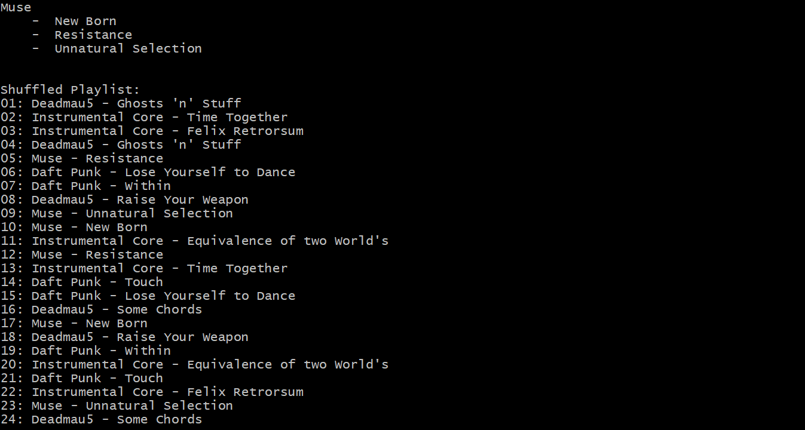

# iPod Playlist

A program that mimics the functionality of a music playlist by first sorting the playlist, followed by shuffling the playlist with songs' consecution in mind.

&nbsp;
## Characteristics
- Both quick sort and merge sort were written to sort the songs and artists.
- The unbiased Knuth Fisher-Yates Shuffle algorithm was used to shuffle the playlist.
- Two approaches to the Knuth shuffle algorithm were written. One starting from the beginning of the array to the second last element, the other from the end to the second element.
- The Consecution code will not work if the inputted songs are less than 6. So a small code is written to ensure that for the number of inputted songs smaller than 6, no songs will be repeated after itself.

&nbsp;
## Task - Create a program that sort and shuffle a list of songs received as input

### Part 1. Read in user input from command line and store the artists and their songs.

&nbsp;
### Part 2. Sort the songs lexicographically via quick sort or merge sort and print out sorted songs by artist.

&nbsp;
### Part 3. Create playlist and shuffle tracks in the playlist using Knuth Fisher-Yates shuffle algorithm to create a random playlist where the same song cannot appear until 5 other different songs have. Finally, print the shuffled playlist onto the command line.

